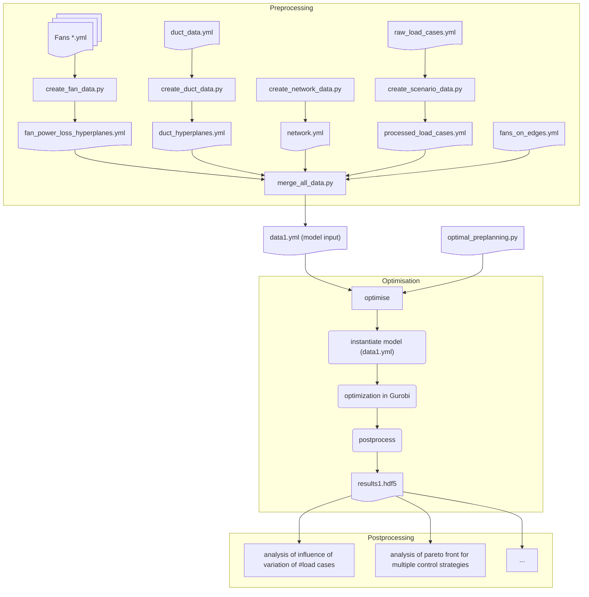

# VentilationSysOpt_Preplanning

Code utilised for publication "*...*", Breuer et al.  
This framework allows optimisation of ventilation systems with respect to duct sizing, fan selection/placement/operation, and volume flow controller placement/operation.  

Variations in control strategies, duct constraints (min/max dimensions, max velocity), and fan data can be explored with the following packages:  
- **underestimating-hyperplanes** --> approximations of fan characteristic curves and duct pressure losses  
- **vensys-clustering** --> ventilation system scenario reduction (load cases + frequencies)  
- **pyomo2h5** --> reading/writing `yaml` and `hdf5` files  

---

## Overview
The repository provides:
- **Input definitions** (YAML files for fans, ducts, network, and load cases)  
- **Preprocessing scripts** to convert input data into model-ready format  
- **Optimisation model** formulated in Pyomo and solved with Gurobi (or other solvers with minor adaptations)  
- **Postprocessing tools** to analyse Pareto fronts, strategy variations, and duct constraints  

---

## Input
You can optimise your own building by preparing the following YAML files:
- `fan_data.yml` → fan performance data (e.g. pressure vs. flow curve, efficiency curve)  
- `duct_data.yml` → duct types and constraints (min/max height/width, max velocity, roughness)  
- `network_data.yml` → network topology (nodes, ducts, connections, rooms)  
- `load_case_data.yml` → demand scenarios (volume flow demands in rooms)  

---

## Preprocessing

Each script prepares part of the input data into a unified format for the optimiser.

- **`create_fan_data.py`**  
  Reads fan files like `Fan1.yml`, approximates fan characteristic curves (using *underestimating-hyperplanes*), and creates model-ready fan input.  

- **`create_duct_data.py`**  
  Reads `duct_data.yml`, approximates duct pressure losses (using *underestimating-hyperplanes*), and converts duct info into model format.  

- **`create_network_data.py`**  
  Reads `network_data.yml` (topology of ducts, junctions, rooms) and prepares the system structure.  

- **`create_scenario_data.py`**  
  Reads `load_case_data.yml`, applies scenario reduction (using *vensys-clustering*), and generates a reduced set of load cases with probabilities.  

- **`merge_all_data.py`**  
  Merges all preprocessed inputs into a single model input file, e.g. `data1.yml`. Besides the above inputs, additionally the `fans_on_edges.yml` is used that describes which fans are located on which edges in the network.  

---

## Optimisation

- **`optimal_preplanning.py`**  
  Defines the Pyomo optimisation model from Breuer et al. (duct sizing, fan placement, control strategy).  

- **`optimise_single.py`**  
  Instantiates the model with a given dataset (e.g. `data1.yml`) and solves it.  
  By default uses **Gurobi**, but can be adapted for other solvers.  

Outputs include:
- `results.hdf5` → all decision variables, constraints, and KPIs  
- Pareto fronts for conflicting objectives  
- Variations with different control strategies and duct constraints  

---

## Postprocessing
Postprocessing scripts allow analysis of optimisation results:
- Analyse influence of the **number of load cases**  
- Analyse **Pareto fronts** for multiple control strategies  
- Explore further variations (e.g. duct sizing limits, fan placement strategies)  

---

## Workflow Example

An example end-to-end workflow is illustrated below:



# Example Usage


## Preprocess input data
```
python -m src.preplanning.preprocessing.create_fan_data.py
python -m src.preplanning.preprocessing.create_duct_data.py
python -m src.preplanning.preprocessing.create_network_data.py
python -m src.preplanning.preprocessing.create_scenario_data.py
```

## Merge into single model input
```
python -m src.preplanning.preprocessing.merge_all_data.py
```

## Run optimisation
```
python -m src.preplanning.optimise.optimise_single.py
```

Results will be written to an hdf5-file (e.g. results.hdf5) and can be analysed with the provided postprocessing jupyter-Notebooks.


# Funding
The presented results were obtained within the research project ‘‘Algorithmic System Planning of Air Handling Units’’, Project
No. 22289 N/1, funded by the program for promoting the Industrial Collective Research (IGF) of the German Ministry of Economic
Affairs and Climate Action (BMWK), approved by the Deutsches Zentrum für Luft- und Raumfahrt (DLR). We want to thank all the
participants of the working group for the constructive collaboration.
